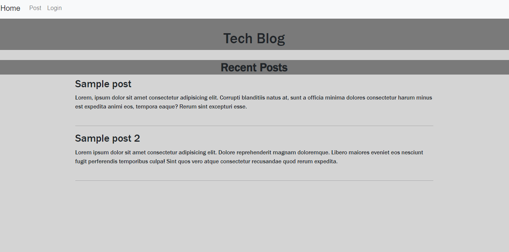

# TechBlog

  

  ***
  ## Table of Contents
  - [Description](#description)
  - [Visual Presentation](#visual-presentation)
  - [Technologies Used](#technologies-used)
  - [Installation](#installation)
  - [Usage](#usage)
  - [Contribution](#contribution)
  - [Testing](#testing)
  - [Additional Info](#additional-info)

  ***
  ## Description
  This Tech Blog application is a CMS-style blog site, where developers can publish their blog posts and comment on other developers' posts as well. When the user creates an account and logs in, they're directed to the Home page, where they can access all the posts made by them or other developers. The user may add comments to the posts and view others' comments as well. On the Dashboard page, the user can fill in a form to create a post, and once they do so, their post will show up below. They may also delete their post. If they decide to logout, they may stil view all posts, but cannot create posts nor comment on them.

  ***
  ## Technologies Used
  Bcrypt, Dotenv, Express, Mysql12, Sequelize

  ***
  ## Visual Presentation
  

  ***
  ## Installation
  This app is not ment to be installed. At the time of production, Heroku is down

  ***
  ## Usage
  Talk about recent tech 

  ***
  ## Contribution
  None

  ***
  ## Testing
  None

  ***
  ## Additional Info
  - Github: TabuHana(https://github.com/TabuHana)
  - Email: nate31196@outlook.com
